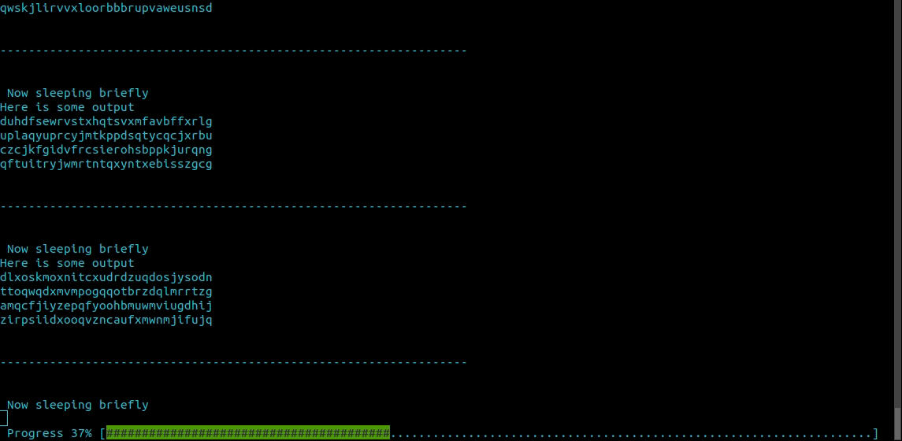

# bash_progress_bar

> Note: There exists also the original [bash implementation](https://github.com/pollev/bash_progress_bar)

This module uses terminal control codes to create and manage a progress bar on the bottom of the terminal.

This python module is intended to imported into your scripts. It will allow you to create a progress bar which does not interfere with the scrolling output of the script. The look and feel for this progress bar is based on the progress bar used in APT.

What makes this progress bar different from the basic terminal progress bars which use carriage return (`\r`) to overwrite their own line, is that this progress bar does not interfere with the normal output of your script. This makes it very easy to update existing scripts to use this bar without having to worry about the scrolling of your output.

An example can be viewed in `test_bar.py`. The actual implementation can be found in `progress_bar.py`

Example output:

